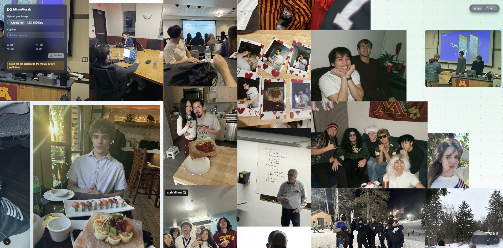

# minnemosiac
Our MinneHack 2025 project.

Members: Kieran Finger, Qise Salem, Justin Nguyen, Victor Hofstetter

## MinneMosaic

**MinneHack 2026 Theme: "Mending over Ending"**

MinneMosaic is a collaborative, never-ending mosaic where anyone can upload an image and snap it into place on a shared infinite canvas. Each tile is mended together, making a community-built collage.

Hover over any tile to read its caption and learn the story behind it.




## How to Run
Running MinneMosiac requires Node.js. Clone the repo, install dependencies, and start the dev server:

```bash
npm install
npm run dev
```

Open [http://localhost:3000](http://localhost:3000) to view the mosaic.

You will need a `.env.local` file with your Supabase credentials:
```
NEXT_PUBLIC_SUPABASE_URL=your-supabase-url
NEXT_PUBLIC_SUPABASE_ANON_KEY=your-anon-key
SUPABASE_SERVICE_ROLE_KEY=your-service-role-key
```

## Technical Implementation
MinneMosaic is built a Next.js App a Typescript React frontend. Images are stored in Supabase Storage with placement metadata (position, size, caption). The canvas uses magnetic snapping that lets users precisely align images to the existing mosaic without gaps or overlaps. 

The project is *~1,078 lines of code* excluding shadcn components.

## Credits
Built with [Next.js](https://nextjs.org/), [react-konva](https://konvajs.org/docs/react/), [Supabase](https://supabase.com/), [shadcn/ui](https://ui.shadcn.com/)
